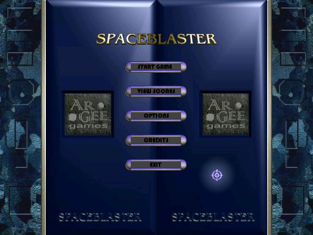



## Spaceblaster Game

### Description

My VB DirectX7 space shooter game. It still needs work. but I was hoping to get some feedback on how well (or poorly) it runs on other machines. Only 2 1/2 levels created at this point.
 
### More Info
 
Needs the ActiveMovie control type library for playing music - should at least be in XP - file is : C:\Windows\System32\quartz.dll

             |
---                |---
**Submitted On**   |2005-08-05 20:26:22
**By**             |[Randy Gomez](https://github.com/Planet-Source-Code/PSCIndex/blob/master/ByAuthor/randy-gomez.md)
**Level**          |Advanced
**User Rating**    |5.0 (174 globes from 35 users)
**Compatibility**  |VB 6\.0
**Category**       |[Games](https://github.com/Planet-Source-Code/PSCIndex/blob/master/ByCategory/games__1-38.md)
**World**          |[Visual Basic](https://github.com/Planet-Source-Code/PSCIndex/blob/master/ByWorld/visual-basic.md)
**Archive File**   |[Spaceblast192150862005\.zip](https://github.com/Planet-Source-Code/randy-gomez-spaceblaster-game__1-62091/archive/master.zip)

